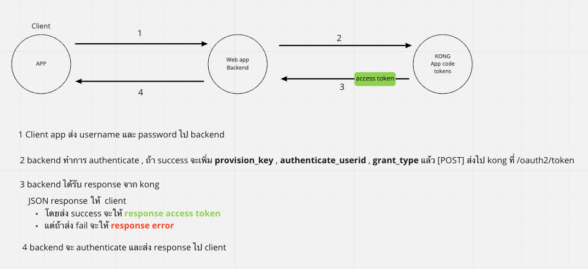

# Resource Owner Password Credentails

overview

## to request Access token

[POST] https://{app.service.com/route/#$%}/oauth2/token

body: {

    client_id: {...},
    client_secret: {...},
    grant_type: "password",
    scope: {"string"},
    provision_key: {...}
    authenticate_userid: {...},
}

response: {

    access_token: {...},
    refresh_token: {...},
    token_type: "Bearer",
    expires_in: {...}
}

---

## to request new Access Token

[POST] https://{app.service.com/route/#$%}/oauth2/token

body:{

    grant_type: "refresh_token",
    client_id: {...},
    client_secret: {...},
    refresh_token: {...}
}